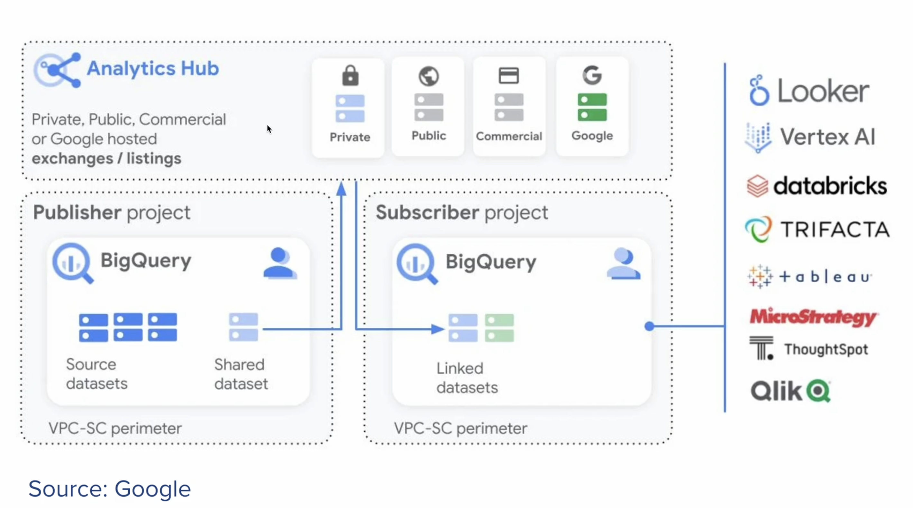
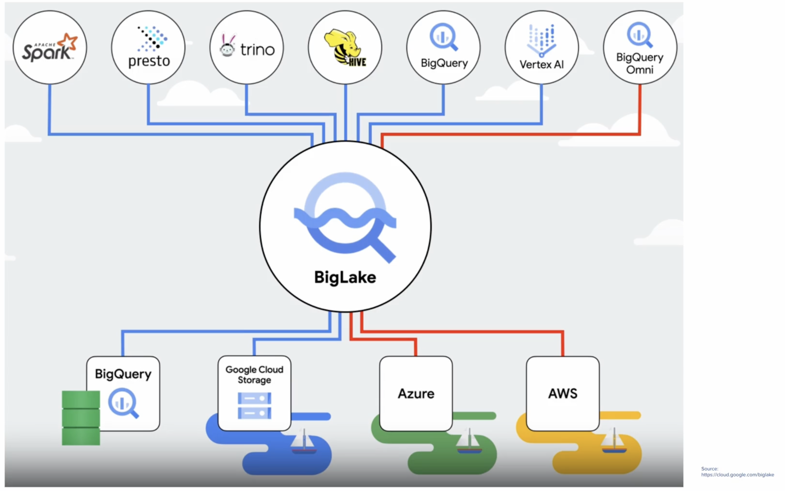
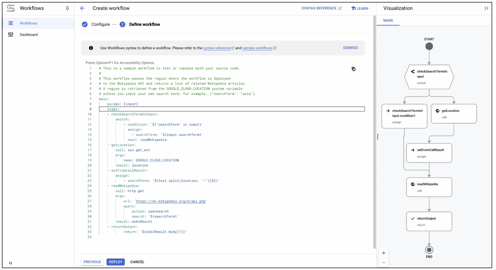
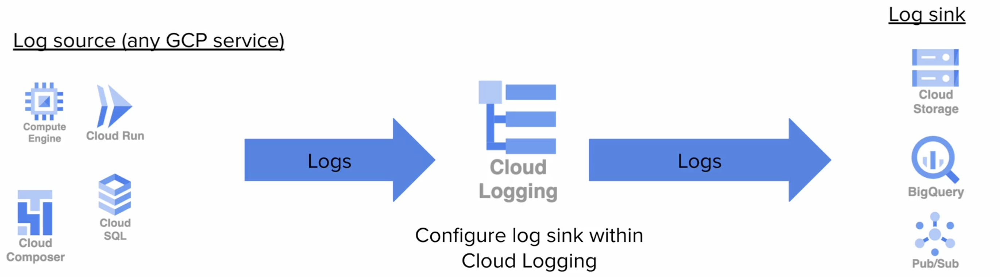

# [WIP] GCP Data Engineering Notes

## Data Lifecycle and corresponding GCP services
**Ingest** = Pub/sub, Dataflow (Google's Apache Beam), Composer, Storage Transfer Service, Application logs from App Engine/Compute Engine/ GKE

**Store** = Cloud storage, BigQuery, Bigtable, Cloud SQL, Firestore, Memorystore, Spanner

**Process/Analyse** = Dataflow (Google's Apache Beam), Dataproc, BigQuery, Data Fusion, Dataprep, Data Loss Prevention API (DLP)

**Explore/Visualise**= Datalab, Looker Studio, custom dashboards, etc

## Types of datas
1. Structured
- Highly organised, easily accessed, processed, analysed
- Typically stored in relational databases
- Adheres to pre-defined format or schema
- e.g. transaction records, CRM system
  - GCP product for it: BigQuery, Cloud SQL, Spanner
2. Unstructured
- "free-form", lacks a predefined structure or schema
- wide range of formats and types
- e.g. text data, image, video data
  - GCP product for it: Cloud Storage
3. Semi-structured
- No fixed schema or structure, but maybe some metadata that describes the data and makes it easier to process
- e.g. JSON, XML, YAML, sometimes data from NoSQL databases
  - GCP product for it: Bigtable, Firestore, Memorystore

ACID Compliance in a database?:
The presence of four properties — 
1. atomicity: broken down into smaller parts
2. consistency: only data which follows the appropriate data validation rules is permitted to be written to the database
3. isolation: ability to concurrently process multiple transactions in a way that one does not affect another
4. durability: make failures invisible to the end-user, e.g. in databases that possess durability, data is saved once a transaction is completed, even if a power outage or system failure occurs.

[Link to explanation](https://mariadb.com/resources/blog/acid-compliance-what-it-means-and-why-you-should-care/)

## Apache vs GCP tools
| Open Source                        | GCP Tool             |
|-------------------------------------|----------------------|
| Apache Kafka                        | Cloud Pub/Sub        |
| Apache Beam                         | Cloud Dataflow       |
| Apache Hadoop and Apache Spark      | Cloud Dataproc       |
| Apache HBase                        | Cloud Bigtable       |
| Apache Hive                         | BigQuery             |
| Apache Airflow                      | Cloud Composer       |

## Types of windows
Windows are good to group streaming data for processing. Group elements by timestamp. 
When your data is generated, it will have a timestamp. But the time when the data is generated may not be the time that your pipeline receives that data. Hence there is a need to separate "event time" from "processing time".

- Fixed Windows
- Sliding Windows
- Session Windows

## IAM - Identity Access Management
Principal = entity that can be granted access to GCP resources

Typers of Principals:
1. User accounts (associated with a human, used for accessing cloud services, authentication done via username/pwd)
2. Service accounts (used by applications to enable automated/scheduled tasks, authentication done via keys/tokens)
   - 2 types of service accounts: google managed (automatically created by Google) or user-managed (created by user, usually has the domain @[project-id].iam
  
There's "roles" (collection of permissions), "permissions" (granular action that can be taken).
3 types of roles:
- basic roles: broad permissions at project level
  - owner
  - editor
  - viewer
- predefined: more specific and tailored for common use cases and job functions --> set and suggested by Google
  - Specific to a given GCP service or API, correlates to common roles/use cases, intended to minimise overhead while reducing security risk
- custom: user defined (good for specified use cases e.g. for external auditors)

Groups:
- manage multiple members with similar or identical access needs, best practice is often to create a Google group, add each member to that group, and add the group to the IAM with the appropriate roles
- typically created with Google workspace domain or combination of environment + project/application + purpose/role. *<environment>-<application>-<role>@domain-name.com* e.g. dev-database-readers@finsecure.com

**Principle of least privilege**

Always allocate the minimum necessary permissions for someone or a service account to do what it needs. Depending on your tolerance for role maintenance, usually this involves using either custom roles or pre-defined roles.

Benefits:
- reduces the blast radius of compromised accounts
- mitigates risk of insider threats
- lowers chances of accidents
- simplified compliance and auditing
  
(if too much permissions is given, devs might accidentally push to wrong production env without testing or hackers can gain info and damage surface is higher)

**Gcloud commands**
- `Gcloud iam roles copy`: can be used to replicate IAM roles to another project, useful for custom roles that you want to keep consistent
- can use `gcloud ____ get-iam-policy` for various resources:
  - `gcloud projects get-iam-policy`: retrieves roles and members that have access to the project
  - `gcloud storage buckets get-iam-policy gs://my-bucket`: retrieves principals with access to the bucket
  - `gcloud compute instances get-iam-policy <instance-name> --zone=<zone>`: retrieves principals with access to the instance

## Pub/sub: publishers / subscribers
2 kinds of messaging systems setup:
1. **Tightly coupled systems**: sender directly tied to the receiver. This directness makes the system more likely to fail
2. **Loosely coupled systems**: have a buffer (or a message bus) between the sender and receiver. Loosely coupling the components makes the system more fault-tolerant and scalable. Allows for message queuing. --> Pub/sub is the buffer. it's the global scale messaging buffer/coupler

***Cloud pub/sub is Google's version of open source Apache Kafka***
- No-ops, serverless (aka we do not need to configure or manage this at all and it scales automaticly)
- often used for data ingestion, can connect to other data pipeline services such as Dataflow
- Delivery of each message is guaranteed at least once
- publishers does not need to wait until the subscribers are available, hence allow scalable and flexible communication between different parts of the application. especially useful for distributed systems or microservices where each component need to deliver information effectively without being directly connected

Terms:
- Publisher: an entity (e.g. microservice or application) that creates and sends messages to cloud pub/sub. doesnt need to know who will receive or process the messages
- Subscriber: an entity that receives and processes the messages. listens for new messages being receivd by pub/sub and tells pub/sub that it received the message
- Topic: a named resource which <ins>publishers</ins> sends messages. like a channel or category under which the messages are sent
- Subscription: a named resource representing the stream of messages from a specific topic to a <ins>subscriber</ins> like signing up to receive all messages posted to a particular topic

**Steps in pub/sub**
1. Topic created within Pub/Sub
2. Publisher sends a messenge to that topic, which Pub/Sub holds in queue to be served through a subscription
3. Subscriber either pulls the messages from the Pub/Sub topic or has the message pushed to them by a Pub/Sub
4. Subscriber acknowledges to Pub/Sub that it has received the message
5. Pub/Sub deletes the message after the subscriber has acknowledged it

**Push vs pull Subscriptions**
- Pull: good for batch delivery, large volume of messages
- Push: good for real-time streaming, low latency use cases
  - to do push sub, the subscriber must be a webhook endpoint that accepts POST over HTTPS

**Metrics for to monitor subscriber health**
1. Total number of messages in the Pub/Sub queue
- indicative of the overall load and throughput of the system. consistently high number can point to insufficient processing power on the subscriber's end or the publisher sending messages at a rate that the subscribers can't handle.
2. Oldest unacknowledged message

**Using Kafka with Pub/Sub**
- May need to use when there are hybrid workloads (connecting on-prem database to GCP), collect logs from on-prem kafka and send to GCP for analysis or have an app in GCP but alsp store data on-prem using Kafka
- GCP has a Pub/Sub Group Kafka Connector to connect Kafka to GCP. 2 versions of the connector, from the perspective of the role Pub/Sub plays in the setup
  - Source connector: reads messages from a Pub/Sub topic and publishes them to Kafka
  - Sink connector: reads messages from 1 or more Kafka topics and publishes them to Pub/Sub

**Additional Pub/Sub Feature**

**Seek** feature: Allows you to change the acknowledgement state of messages, including already-acknowledged messages in bulk. can replay previously acknowledged messages and snapshot to specific time
- Seeking to a <ins>snapshot</ins> allows you to return to the message acknowledgement state of a subscription
- Seeking to a <ins>time</ins> marks every message received before the time as acknowledged and every message after the time as unacknowledged
- can set a topic message retention policy. max and default is 7 days

## Parallet Data Processing - Cloud Dataflow
- Dataflow is the GCP managed version of Apache BEAM (aka **B**atch/str**eam**). It is auto-scaling, serveless/no-ops.
- Natively integrates with Pub/Sub, BigQuery
- Connectors available for Bigtable, Apache Kafka
- Pipelines must be located with a single region

**Key Terms**
Element = single entry of data (i.e. a row of data)
PCollection = Distributed data set, data input and output
ParDo = a type of transform applied to individual elements. ParDo is good for filtering/extracting elements from a large group of data
Transform = processing operation applied to data

types of windows to handle streaming data:
1. Tumbling windows (aka fixed windows)
  - fixed duration, non-overlap, sequential
2. Hopping windows (aka sliding windows)
  - overlap, has a frequency (called a hop interval), fixed duration (e.g. each window is 30s, but refresh/hop every 10s)
  - for fast based, time sensitive data to ensure there is the most up-to-date data (aka stock analysis)
3. session-based windows
  - irregular/dynamic duration, based on how long the session is
  - as long as the event happened within a designated gap threshold (e.g. 5 min threshold) as long as the interval between each event is lesser than the threshold, it will be classified as the same session
  - e.g. clicks in a websession

**Other Dataflow concepts you should know**
- Watermarks = timestamps that keep track of progress in your pipeline
  - If a step fails or stalls, the watermark does not advance
  - Watermarks are timestamps that help track the progress of data processing in a pipeline. They essentially tell the system how far along the stream of data it has processed. If a step in your data pipeline fails or stalls, the watermark does not move forward, meaning that the system recognizes that certain data hasn't been processed yet. This helps ensure that no data is left behind or processed out of order.
  - Example: If your data is streaming from multiple sources with different latencies, the watermark ensures that you don’t process data from one source too early before data from slower sources has arrived.
- Triggers = conditions that determine when the aggregated results of data, such as those in a window, should be emitted/outputted, esp in systems with unbounded data
  - Especially important in unbounded/streaming data pipelines
  - Triggers are the conditions that determine when data (usually aggregated or transformed data) is outputted from the system, especially in streaming systems. Triggers decide at what point the aggregated data (like data grouped by time windows) should be emitted.In unbounded or streaming pipelines, you can't wait forever to process data, so you need to decide how often or under what conditions to output the results (e.g., after a certain time window, after receiving a certain number of elements, etc.).
  - Example: Imagine you're counting the number of events per minute (time window). A trigger might decide to emit the count every minute, or every time a batch of 100 events arrives, or some other custom condition. Triggers can be tuned to fit the needs of the pipeline (early results, late results, etc.).
  - Triggers are especially important in unbounded or streaming pipelines because these pipelines handle continuous data streams that don’t have a natural endpoint. Therefore, you need a way to decide when to finalize or partially emit results without waiting for all data to arrive (which might never happen).

## Scaling 
Horizontal scaling: increasing the number of nodes/workers (vs Vertical scaling which is to add more compute to existing nodes)

## Preventing Fusion
Fusion: Dataflow may combine several steps of the pipeline into one (do all the steps together)

However it might not always be efficient for fusion to happen cause it might think a task is smaller than it really is, and affect how it distributes tasks to the workers.

Techniques to overcome fusion (to optimise worker usage, hence speeding the ops up):
- GroupByKey + Ungroup: group the data and immediately separate it again. forces Dataflow to treat the data as more significant and not combine the steps
- SideInput: take the data an expand into a sideinput for another operations. forces Dataflow to take a detour rather than doing and combining the next steps. Refers to a secondary data source that is used alongside the main input in a transform. Allows additional data to be accessed and used within the transformation process
- Reshuffle: rearranges data, hence acts a break in the pipeline that stops Dataflow from combining steps. will help to ensure that each datapoint is unique?

## Dataflow Best Practices 
- **Catching errors**: Catch errors within the pipeline by using a try-catch, and then output the errors to a new PCollection. Send the PCollection somewhere, such as Pub/Sub, for later analysis.
- **Missing messages**: If you notice some messages are missing from your pipeline, you can run a batch of the streaming data and check the output.
- **Out-of-order data**: Use a combination of windows, watermarks, and triggers to logically separate your time windows, determine when the results were generated/submitted to Dataflow, allow stragglers to catch up, and decide when you should emit them.
- **Updating a pipeline**: When you need to update Dataflow pipelines with new code, do "update job." This technically creates a new job with the same name but a new jobID.
  - GCP will perform a compatibility check, so you have to make them compatible with a "transform mapping" JSON file that you provide. It maps old job transforms to new job transforms.
 
## When to use Dataflow vs Dateproc
Dataproc when:
- have dependencies on specific tools/packages in the Hadoop/Spark ecosystem
- favour a DevOps/hands-on approach to operations over a serverless one

Dataflow when:
- no existing Hadoop/Spark ecosystem
- prefer a serverless/hands-off approach to ops
- generally better option

# Dataproc: ondemand, managed version of Apache Hadoop and Spark
MapReduce: Hadoop function to distributed/parallel compute to process large data in parallel. 
- Map phase: input data divided into smaller chunks, each chunk processed by a map function that transform the data to a key, value pair
- Shuffle phase: key-value pairs are grouped by keys and sent to different reduce nodes
- Reduce phase: reduce function applied key-values pairs in the reduce nodes to aggregate the values together under the same key to produce a final results (combine all the values of same keys together)

**Storing data for Dataproc jobs**
- when moving from Hadoop or Spark to Dataproc, usually good to store data in Google Cloud storage and jobs on the Dataproc cluser
- Possible exceptions depending on the type of data you work with:
  - Apache HBase data to Bigtable (fully managed no-sql database service designed for large analytical and operational workload)
  - Apache Impala data to BigQuery (serverless multi-cloud data warehouse, sql-based)
 
**Configuring a Dataproc cluster**
Choose: 
- region & zone
- cluster mode (# of masters and # of workers)
  - Single node: 1 master, 0 workers
  - Standard node: 1 master, custom no. of workers
  - High availability: 3 masters, custom no. of workers
- Disk size for master and worker nodes
- Local SSD size (cannot be changed)
- no. of preemptible nodes/VMs
  - (aka on-demand VMs that are lower in cost than standard VMs but are short-lived and can be claimed by GCP whenever there is a demand from a more higher paying customer. need min 2 worker nodes. best used for compute-intensive tasks that are resilient to interruptions and do not require persistent storage. Dataproc manages the entire leave/join process of preemptible VMs without configuration required. will help jobs to reduce time
- cloud storage bucket for staging

After a Dataproc cluster is created, can change:
- no. of workers and preemptible VMs
- labels of cluster
- toggle graceful decommissioning
resharding of data is handled automatically when you update a dataproc cluster

**Cluster migration best practices**
- move the data first (usually GCS)
- perform small-scale testing on a sub-set of data first
- think in terms of ephermeral clusters (delete cluster when done)
- Use GCP tools to optimise and save costs
- eventual goal should be to move towards a cloud-native and serverless architecture

Type of Apache data to Dataproc:
HDFS => GCS
Hive => BigQuery
Impala => BigQuery
HBase => Bigtable

**Ways to optimisze Dataproc cluster performance**
- Place Dataproc cluster in same region as storage bucket that has your data (less egress/ingress)
- Increase size of persistent disk for better performance
- Consider SSD over HDD (more expensive though)
- Allocat more VMs (choose preemptible VMs to save on costs, but this option will cost more than increasing disk size though)

**Dataproc IAM roles**
- Editor (full access to create/delete/edit clusters, jobs, workflows)
- Viewer (view access only)
- Workers (for service accoounts to read/write cloud storage and write to cloud logging)
^ can only be defined on project level

## Google Cloud Storage (GCS)
Stores in buckets, all kinds of files are called "objects". Similar to blob storage/S3

**Storage class vc Costs:**
Consider storage duration and access frequency. Lower frequency access options, lower costs, but higher retrieval costs

- Standard: Access whenever, $0.02/GB --> frequency access
- Nearline: 30 days min storage (aka recommended to store at least 30 days. if you take your data out before that, you are still charged the full price), $0.01/GB
- Coldline: 90 days min storage, $0.004/GB
- Archive: 365 days min storage, $0.0012/GB --> least accessible, lowest cost but higher retrieval fee

**Bucket management and data locality**
- Buckets act as primary storage containers
- location options when setting up a bucket:
  - regional (will be in at least 2 separate zones in the same region)
  - dual-regional 
  - multi-regional (can be across diff countries, good for global companies)
- Optimised for latency and durability

**Accessing and using GCS**
- can use to access via: UI, API, SDKs, gsutil
- Features:
  - parallel uploads for large amounts of data --> optimise upload process and data transfer
  - requester-pays model good for sharing public datasets
  - integrity checks --> ensure data integrity with built in validation mechanisms. md5 crc32c hash can be pre-calculated and uploaded together for post upload verification (to ensure no data loss)
  - transcoding --> gzip transcoding to enable storage in compress format and automatically decompress on retrieval providing the users with the original file format
 
**Lifecycle Management**
- Transition rules based on conditions from 1 storage class to another (e.g. auto-archive older files)
- Cost reduction through automated management
- Deleting outdated or unnecessary data

**Access control**
- can have signed url access (time-based, got expiration, good for temporary access)
- IAM on project level
- ACL on specific buckets
- complete control over data access permissions

**Roles in data pipelines**
- can also automatically trigger processes in other GCP services (e.g. cloud functions, pub/sub)
- GCS as a dynamic component of data pipelines
- workflow initiation upon data arrival
  
# Bigquery (BQ)
- fully managed and serveless relational database
- BQ is a database optimised for extremely fast read operations and analytical queries.
- BigQuery is a fully-managed, serverless data warehouse that is designed to be extremely fast at read operations, particularly large-scale analytical queries. This is achieved through its columnar storage format and massively parallel processing.
- Updates, or writes, are slower in comparison to reads because BigQuery is optimized for append-mostly scenarios and is not intended for transactional workloads that require rapid updates. For use cases involving frequent writes or updates in a relational database, Google Cloud recommends using Cloud SQL or Spanner, which are optimized for transactional workloads and support high-throughput writes and updates.
- accepts both batch and streaming loads
- uses standard SQL (or legacy SQL, but not recommended for new projects. mainly there for backwards compatibility)

- The BigQuery Transfer Service is designed to automate data import from Software as a Service (SaaS) applications, specifically Google advertising platforms such as Google AdWords, DoubleClick, and YouTube, into BigQuery. This service simplifies the process of integrating advertising data into BigQuery, enabling seamless and recurrent data transfers. The service is particularly tailored to work with Google's advertising services, thereby making it easy to analyze advertising data alongside other data sources within BigQuery. This integration is not about exporting data from BigQuery, migrating on-premises databases, or backing up datasets, but rather about importing and synchronizing data from specific Google services.

- Federated table: query directly from external sources like google drive, cloud or BigTable. Hence able to have real time analysis without storage costs. need to set up a schema to map to the external data structure so BQ knows how to map the data. governed by the BQ access permissions
- Looker studio is GCP's free BI and data visualisation tool.
  - results generated in BQ can be immediately explored with charts
  - alternatively, set up BQ tables as data sources in Looker Studio and write queries/views in Looker Studio UI

**Ways to Access BQ**
- cloud console
- BQ command line tool
- client libraries (GO, python, Java, Node.js, PHP, Ruby, C#)

**Ways to Load data into BQ**
- **Web UI**: Upload small datasets directly.
- **BQ Command-Line**: Automate uploads from local or cloud storage.
- **Cloud Console**: Import via browser from local or Google Cloud Storage.
- **BigQuery API**: Stream in real-time or batch load programmatically.
- **Storage Transfer**: Move <ins>large volumes from online sources</ins> like Amazon S3.
- **Dataflow**: ETL operations and streaming data processing.
- **Data Transfer Service**: Schedule data imports from SaaS applications.
- **Cloud Dataprep**: Clean and prepare data for analysis.
- **Streaming Inserts**: Real-time data capture and analysis.
- **Database Transfer Service**: Migrate data <ins>from on-premises or Cloud SQL</ins>.
- **Federated Queries**: Query external sources without loading.

When considering which way to load data, consider the size of the data, the need for real time updates, and complexity of the transformations

**Nested tables**
- Nested tables is a structure that a single table can create sub-tables, allowing the storage of hierachical data in a single column. similar to having a table within a table.
- Hierarchical Data: Store complex data hierarchies within single rows.
- implemented using RECORD/STRUCT Data Types: Define sub-tables within a column. Define a schema within a schema where 1 field can contain a repeated set of fields. useful for 1:many relationships.
- Efficient Queries: Use **UNNEST** to flatten nested data for analysis.
- Performance Advantage: Columnar storage reduces data scan costs.
- Simplified Management: Avoids multiple tables and complex joins.
- JSON Integration: Seamlessly maps JSON structures to nested fields.

**Types of Backups**
1. Automatic Replication: Data is automatically replicated across multiple locations, ensures high availability and durability.
2. Disaster Recovery: Managed by Google for large-scale system failures, not intended for individual user errors oraccidental deletions.
3. Time Travel: Query snapshots of data from the past 7 days, restore tables to previous states within this period.
4. Snapshot Tables: Create manual snapshots for long-term backups, useful for archives beyond the 7-day time travel window.
5. Export Data for Backup: Export tables to Google Cloud Storage, Formats include CSV,JSON, and Avro.

Note: No traditional backup-and-restore functionality.

**BigQuery best practices**
- Instead of using SELECT*, specify the columns you need
- Pay attention to the size of the query before running it. BQ charges based on the size of the DATA PROCESSED
- Remember: LIMIT and HAVING do not reduce costs, but WHERE does (limit and having dont return all values but you are still charged for it)
- Establish the logic of youir query on small subsets of your data first
- Save intermediate tables and then query those instead
- Streaming ingest is expensive --> if real time analytics is not important, consider batch loading instead
- Better to have more, smaller tables than fewer, larger tables
- When joining tables, use INNER JOIN instead of WHERE. Using WHERE creates more variable combinations,more computation needed. Inner join can be more efficient in processing only the mapped rows
- For table design, better to have smaller more numerous tables than larger and fewer ones. smaller tables has better cost savings
- Use expiration settings for tables to delete old data that u don't need
- Take advantage of long-term storage data pricing for data that are not accessed regularly to reduce storage costs

**BigQuery admin console**
- slot capacity management: to monitor the capacity usage and the allocation of the capacity to ensure that all the applications have the resources they need. Important for flat rate pricing
- policy tag taxonomies: classify and manage access to data by defining and applying policy tags, control who has access to sensitive data
- Query INFORMATION_SCHEMA (its a metadatabase containing information about all other databases and tables) to get a sense of the performance of the jobs and how our queries are running over time.

**BQ Views**
In BigQuery, a view is essentially a virtual table created by a query. Unlike physical tables that store data, views do not store data themselves. Instead, they represent the result of a query and can be queried against as if they were tables. This "query within a query" functionality makes views particularly useful for presenting a specific view of the data without altering the underlying tables. They provide a level of abstraction and can be used to restrict access to certain data, thus enhancing data security and management.

1. Standard views: standard see the tables views, executes the underlying query-on-demand and show a virtual table representing stored SQL queries
2. Materialised views: cached query results for faster performance, good for queries that are often used. automatically updated when base tables changes
3. Authorised views: grant a specific view of the tables, control data access by excluding sensitive details. shares query results, not the raw data with the specified users
4. Logical views (BI engine): virtual schema within BI engine for optimised performance, ideal for BI tools and connected sheets

**BQ Roles**
PROJECT LEVEL:
- BQ Admin: full control over BQ resources
- BQ User: create datasets, manage jobs
- BQ Job User: run jobs & queries

DATASET LEVEL:
- BQ Data Owner: manage and share datasets/views

DATASET / TABLE LEVEL:
- BQ Data Editor: modify and delete table data
- BQ Data Viewer: read-only access to the tables/views

PROJECT/DATASET LEVEL:
- BQ Metadata Viewer: access dataset/table metadata

**BQ Slots**
- unit of compute used by BQ to execute queries
- key to determining performance and cost
- slots are automatically assigned to queries
- more slots = faster query execution but at higher costs

<ins>Managing costs</ins>: 
- can monitor the slots usage and adjust the queries or dataset partitions to ensure the slot utilisation is efficient. need to maintain cost and performance
- knowing how many slots ur queries need, can optimise the data processing and manage the budget accordingly

**Types of Slot Pricing Models**
1. **on-demand pricing (default)**: per per query based on <ins>amount of data processed</ins>
  - good for ad-hoc analytics, variable workloads
  - pay for what you use, good for sporadic queries, when no service level agreement for production workload
2. **flat-rate pricing**: purchase dedicated slot capacity
  - Good for high and predictable workloads, some production workloads

**FLAT-RATE CONFIGURATIONS**
- Enterprise edition reservations: reserving a fixed number of slots with autoscaling options, e.g. baseline reservation with the ability to autoscale for peak demands
- Autoscaling benefits:
  - flexibility: scale up during peak ties and scale down during low usage
  - cost efficiency: pay for extra slots only when needed
 
**Cost Optimization Strategies**
1. combining pricing models
  - mixed approach: flat-rate fee for predictable workloads and on-demand for ad-hoc queries. (e.g. reserve slots for predictable production jobs and use on-demand pricing for analytics queries)
2. Monitoring and adjustments
  - regularly review/monitor usage and adjust reservations and strategies accordingly using BQ's built-in tools to track and manage slot utilisation

<ins>**Exam tips here:**</ins>
- **node outage will not affect BQ data cause storage and compute are separate in BQ.** Explanation: BigQuery is designed with a separation of storage and compute resources, which means that the data stored is independent of the compute resources used to process queries. In the event of node outages, the data within BigQuery would remain unaffected because it is not stored on the compute nodes themselves. This architecture enhances the reliability of data storage and ensures that data is not at risk during compute resource issues. Other options, such as complete data loss or temporary data unavailability, would be consequences of a system where storage and compute are not decoupled. Slowing down query performance is more related to the availability of compute resources rather than the integrity of the data itself.

## Bigtable
- High performance, massively scalable NoSQL database
- Other examples of NoSQL DBs: Redis, MongoDB, Cassandra, HBase, Firestore
- Good for flexible data models, varied data types (aka the data doesn't always have the same keys/columns, unlike structured data)
- Good for rapid read and write operations, hence good for high throughput analytics like stock data, time series data. Tables that follow this pattern tend to be tall and narrow
- IT IS NOT NO OPS, NEED TO CONFIGURE THE INSTANCES etc
- Need to establish row key carefully. Good row keys distribute the load across Bigtable's nodes, bad row keys lead to hotspotting (disproportionate load is handled by a small number of nodes, potentially impacting performance)
- tables are sparse, empty cells table up no storage space. results in significant storage savings esp for datasets that have lots of optional fields
- stores in key-value pair (think dictionary)
- Developed internally for Google, then HBase (Hadoop, open source) was developed based on it. Now Bigtable works well with HBase, so devs can now migrate HBase workload to GCP managed Bigtable services without having to re-write their applications

**Bigtable instance configuration**

<ins>3 things to config when setting up:</ins>
1. Instance type, either:
 - Dev env suggestion: 1 node, low cost, no replication
 - Prod env suggestion: 1+ clusters, 3+ nodes per cluster (for high availability and redundancy), replication available, throughput guarantee
2. Storage type (HDD or SSD): SSD is amost always the right choice (quick retrieval and low latency operations), unless storing > 10TB of infrequently-access data and latency is not a concern
3. Zone for cluster to be in (affects latency for users and also data residency requirements)

Can interact wih Bigtable through cbt (commandline tool) or HBase shell. 
configuring it correctly is important for performance, scalability and cost.

**Bigtable Schema Design**
- efficient schema design will affect how the DB scales and how quickly you can access the data in Bigtable
- <ins>only the row key is indexed in Bigtable</ins>, so schema design is extremely important
- recommended to promote all the fields you want to be able to query against into the row key itself
- however need to be careful to avoid hotspotting (happens when a large amount of read/write targets a small amount of nodes, leading to potential bottlenecks):
- Best pracs to avoid hotspot:
  1. use reverse domain names (com.mywebsite.www) --> spreads out the write ops across the key space, else the "www" will make everything in the same instance/space 
  2. timestamps, but don't put at the front of the row key so they all end up writing to the same instance. can consider pre-fixing them to the reverse domain name
  3. string identifiers, but avoid monotonically increasing strings where those that would result in sequential access patterns as they can lead to hotspots
- row keys to avoid:
  1.  domain names that are not reversed (cause they are monotonically increasing, see point 3 above^)
  2.  sequential numbers
  3.  keys that need to be updated frequently --> leads to increase complexity in data management
- Bigtables are "sparse", empty cells don't cost any storage, hence cna create as many column qualifiers as you want without worrying about storage costs for unused cells. good for wide tables with many options on columns

**Salting in Bigtable**
- technique to improve the distribution of read and write operations across Bigtable nodes, to prevent hotspots. In Bigtable, distribution is based on the row key
- Hotspot Prevention: Salting distributes read/write operations evenly to avoid overloading nodes.
- Row key data that are more similar will be grouped together on the same node. hence to disperse data distribution, can add a random prefix to row keys for a more uniform data spread across nodes. Else if this data is very frequently queried, it can result in hotspot.
- Row Key Randomization: Utilizes random numbers or hash values as prefixes (or timestamps?), so rows that are usually going to be adjacent will be split up
- Load Balancing: Enhances performance by preventing skewed loads on individual nodes. hence the idea for salting is to scatter the data that are frequently queried to prevent hotspot
- Considerations for Use:
  - Access Patterns: Salting strategy should align with <ins>expected data access patterns</ins>
  - Range Queries Impact: Can complicate range queries due to non-sequential row keys
  - Strategic Implementation: Must be carefully planned to balance load distribution and query efficiency. Salting can prevent hotspots but it can make queries less efficient if you distribute the data non-strategically
 
**Field promotion in Bigtable**
- A design strategy where certain fields from the data model are included in the row key to enable efficient access
- Purpose of Field Promotion: Enhances query efficiency by including important fields in the row key.
- Access Pattern Optimization: Aligns row key design with common query filters for faster data retrieval.
- Row Key Structure: Incorporates critical fields into a compound row key to avoid full table scans (aka combine a few columns together together to form the row key)
- Design Considerations:
  - Balance between read optimization and write performance --> while field promotion might improve read, it may result in read complexities
  - Anticipate growth in data volume and access complexity.
  - Query Performance: Significantly reduces latency for filtered queries on promoted fields.
  - Schema Strategy: Requires thoughtful planning to ensure scalability and maintain performance over time.

LIKE SALTING, FIELD PROMOTION REQUIRES GOOD UNDERSTANDING OF THE ACCESS PATTERN (aka query pattern). what kind of queries and how often those queries are done are important for the design. It can affect the database performance and the complexities of the data model.

**Bigtable key visualizer**
- Interactive access pattern monitoring tool, gain insights on how usage is affecting the database perfomance and table proactive measures to ensure the database scales efficiently
- Heatmap Visualizations: Displays intensity of read/write operations across row keys
- Hotspot Detection: Identifies concentrated areas of high activity within your table

## BigQuery Omni *LIKELY TO COME OUT FOR EXAM!*
- intended to unify multi-cloud analytics. cause most companies now use more than 1 cloud provider, and they wanna see the analytics across
- core feature: ability to analyse data across GCP, AWS, Azure without moving data
- power by Google Cloud's Anthos, facilitating a seamless multi-cloud experience for BQ to run analytics across different clouds as if they were a single env. Abstracts away the complexities of the different cloud structures, presenting a unified interface

**Key Features**
- <ins>Able to perform SQL queries on data stored in various cloud DIRECTLY from BQ's interface</ins>
- Seamless intergration: uniform experience w BQ's standard SQL and tools, across different clouds. NO NEED TO LEARN DIFFERENT LANGUAGES OR DIFFERENT TOOLS
- Data security: adheres to Google cloud's stringent security and privacy protocols, even across the different clouds
- Cost-effective: Reduces the need for data movement, lowering costs and operational complexity

**exam tip:** consider choosing BQ omni if given a scenario where there is a need to integrate data into BQ from multiple cloud platforms

## Analytics Hub
- centralised platform for data sharing and collab
- launched in 2021 to address growing need for seamless and secure data exchange within and between orgs
- enhances data accessibility and insights (can help to breakdown data silos)
- has advanced security and privacy controls
- scalable and reliable infrastructure
- integration with GCP services (e.g. BigQuery, Looker Studio, etc)

- flow: publisher > analytics hub > subscriber
- has a publisher/subscriber model. subscriber will see a curated data that is linked to the publisher's. subscriber's data view will be read-only, and in subber's own VPC. 
- for the subscribers, the data can be combined with their own dataset, and can be connected with various solutions from GCP or its patterns (as seen on the right). example of usage: a retailer wanna share forecast to their supplier/vendors on sales forecast or stocks
- publisher can also add metadata to track subbers, see aggregated usage metrics and this makes the process transparent and efficient
- has "Private Exchange feature"
  - A secure, controlled environment for sharing sensitive data
  - Benefits:
    - Enhanced data privacy
    - Controlled access to data assets
    - Customizable sharing policies
  - Use Cases:
    - Sharing proprietary data within a company
    - Collaborating with trusted partners on sensitive projects

**exam tip:**
Choose analytics hub if:
- Healthcare providers sharing patient data securely
- Financial institutions collaborating on market research
- Retail companies analyzing customer behavior data

whenever:
- You are sharing data with another organization
- You are sharing sensitive data within your organization or a trusted partner

## BigLake
- integrates data lakes and data warehouses across GCP, AWS, Azure
- another GCP offering for hybrid and multi-cloud solutions, aims to "break down data silos"
- perform analytics regardless where the data is stored (even in other clouds)
- not just analytics, but also applies other benefits of BQ:
  - fine-grained security, performance, caching, sharing
- able to maintain a single copy of data wherever it is and make it accessible across GCP and other open source tools (using BigLake connectors)
- accessible through the BigQuery UI

- Granular security policies:
  - able to set <ins>**table, row, or column** level access control, even if the data is stored in other clouds</ins>
  - integrates with Dataplex, Data Catalog for data governance, management, etc
- Advantage of BigLake tables over external tables:
  - BigLake tables allows you to treat data as native
  - Better performance
  - More granular security and access control
  - Integrated metadata caching (ex. table schemas, partition information, security policies) improve performance
- Example business scenarios:
  1. You have a multi-cloud environment with GCS and S3 buckets, and your team members need to analyze them without accessing the underlying storage buckets. What should you do?
    - Ans: Set up a BigQuery Omni connection to the S3 bucket, and use BigLake tables over GCS and S3 data so that you can query them in BigQuery.
  2. You have tables in AWS, Azure, and BigQuery for analytics purposes. You need to run daily queries without moving the data. What should you do?
    - Ans: Set up a BigQuery Omni connection and BigLake tables.
  3. Your company has data in GCS. You need to use Spark on this data and implement row-level security policies. Your solution should support a data mesh architecture. What should you do?
    - Ans: Define a BigLake table. Create policy tags in Data Catalog. Add policy tags to the rows, and process with Spark-BigQuery connector. 
  4. You've created an external table in BigQuery with data in a Cloud Storage bucket, using many files. The queries are slow, and you need to improve their performance. What should you do?
    - Ans: Switch to a BigLake table and enable metadata caching. --> **defining external tables (external to BQ) as a BigLake table actually improves performance!**

## Cloud Composer (aka Apache Airflow)
- fully managed implementation of Apache Airflow (no-ops, Google manages it). 
  - Cloud Composer is a fully managed service that is built on Apache Airflow. It provides a way for users to orchestrate their workflows, which can include anything from data processing tasks to automated infrastructure setup. Apache Airflow is an open-source tool designed to help developers orchestrate complex computational workflows, which can be a series of tasks that data must move through. As a managed service, Cloud Composer handles much of the operational overhead associated with setting up and managing an Airflow environment, which includes provisioning resources, scaling, monitoring, and ensuring reliability.
- Airflow = open source programmatic framework to create, schedule, manage, monitor data workflows across clouds and on-prem data centres
- is a built in orchestrating tool
- Airflow is useful because:
  - Big data pipelines are often a complex, multi-step process. Airflow ensures that the creation of the resources in every step that the next step depends on is created in the right order.
  - Must create resources in multiple services
  - Complex dependencies between steps is respected
  - Remove resources automatically when task is completed
  - Need central view for entire team to have visibility --> able to have better tracking and transparency
  - Complex, time-based or event-driven scheduling --> can have different triggers
- Airflow's design principle is centered on configuration as code, meaning that the workflows are defined as code and thus benefit from version control, testing, and collaboration.
- DAGs: Directed Acyclic Graph (visual representation of the flow chart of the steps)
  - Directed Acyclic Graphs (DAGs) are the fundamental building blocks in Cloud Composer that enable users to manage and orchestrate workflows precisely. A DAG represents a sequence of tasks along with their interdependencies, which ensures that they are executed in a clear and logical order. This structure is crucial for accurately defining the steps involved in a workflow and the conditions under which each step should be executed. The acyclic nature of a DAG means that it does not loop back on itself, ensuring that the workflow progresses forward without any circular dependencies, which could cause errors or never-ending loops.
  - DAGs in Cloud Composer not only allow for the **mapping out of the entire lifecycle of data processing** tasks from ingestion to analysis but also **automate the scheduling and execution** of these tasks. This is crucial because it ensures that workflows are not just conceptual but are practically implemented and maintained within the system. The automation of these tasks ensures precision and timeliness in execution, moving beyond the simple transfer of data to a more sophisticated sequence of operations. The visual representation provided by DAGs helps team members understand and communicate the workflow process more effectively, while the automation ensures that these operations are triggered as needed, keeping data fresh and insights timely.
- CLOUD COMPOSER = Apache Airflow + Google Kubernetes Engine + Cloud Storage
  - Apache Airflow allows users to design and schedule complex data workflows. 
  - Google Kubernetes Engine ensures that these workflows run in a secure environment that can scale as needed. 
  - Cloud Storage provides a reliable place for the persistent storage of artifacts that are generated or used by the workflows.

## Cloud Workflows
- Fully0mamanged service that allows orchestration and automation of the execution of GCP services and HTTP-based APIs in a reliable, scalable, and serverless manner
- Enables sequencing and execution of multiple cloud tasks, e.g.:
  - Calling a Cloud Function
  - Triggering a Cloud Run service
  - Making an API call to a Google Cloud service like BigQuery or Cloud Storage
  - Running a custom script or command on a Compute Engine instance
  - And many other operations within the Google Cloud ecosystem
- serverless
- built-in mechanisms for managing failures and retries
- scales automatically
- offers a visual graphical interface for workflow creation and monitoring
  - yaml file based, similar to github actions?

### Cloud Workflows vs Cloud Composer vs Cloud Functions
|Cloud Workflows|Cloud Composer | Cloud Functions|
|---|---|---|
|- Microservices orchestration - Serverless - Low latency - Simple workflows - YAML config|- Data pipelines - Complex logic - Batch jobs - Python config + dev - Orchestrating multi-cloud - Apache Airflow|- Event-driven tasks - Serverless - Small, focused functions - Rapid development - Programming languages (inc. Python)|

## Cloud Data Fusion 
- Data Fusion is a fully-managed data integration service for quickly building and managing data pipelines
- Claim to fame is that it provides a point-and-click Ul to transform/wrangle data and create pipelines. primary function is to facilitate the manipulation and organization of data through a user-friendly interface.
- Can connect to other clouds, SaaS products, and on-prem systems
- Create data marts, warehouses, data lakes
- Allows for connecting and transforming data, making it easier to prepare and manage data for various analytics needs

**Some feature/sub-products highlights:**
- Pipeline Studio: Designing developing and managing data pipelines. Design and development of data pipelines take place here. env that supports the building of ETL processes to manage the lifecycle of the data workflows
- Wrangler: Data preparation and exploration, code-free env for data transformation and exploration
- Datastream:
  - serverless, fully-managed **change data capture and data replication service** in Data Fusion
  - designed to manage the process of detecting and capturing changes made to a database and then replicating that data to another location. 
  - particularly useful for keeping data synchronized across different environments, such as replicating data from an on-premises database to a cloud platform like Google Cloud Platform (GCP).
  - If you have an on-prem database that you want to replicate to GCP, Datastream is a great choice. E.g. on-prem Oracle database replication to BigQuery. captures the on-prem DB updates onto GCP

## Dataform
- Tool for **managing data transformation workflows** in BigQuery.
- Key Features: SQL-based data transformations, version control integration, and workflow automation.
- Enhanced data quality (got assertion checks to check the data quality), streamlined ETL processes (hence increases efficiency and reliability), and collaborative workflow management.
  - allows for the implementation of assertions and tests as part of the data transformation process, which is crucial in maintaining the integrity and reliability of data models, especially in scenarios where data accuracy is critical.
- Ideal for data warehousing, building data models, and automating complex data engineering tasks.
- Seamless integration with other GCP services for a cohesive data engineering ecosystem.

## Dataprep
- Tool for visually **exploring, cleaning, and preparing data** for analysis in GCP.
- Powered by Trifacta
- Key Features: Intuitive user interface, automatic data schema detection, and pattern recognition for data cleansing and transformation.
  - Good for large datasets where manual data cleaning is cumbersome and prone to errors
- Accelerates data preparation processes, ensures data quality, and enhances productivity for data analysts and scientists.
- Ideal for preparing raw data for analytics, machine learning, and business intelligence.
- Seamless integration with BigQuery, Cloud Storage, Dataflow and other GCP data services.

## Dataplex
- Intelligent data fabric to manage data across different storage systems. 
- Key functionalities: 
  - unified data management, provides a consolidated view and control over data stored in different places (data lakes, warehouses, or operational databases)
  - automated data lifecycle management, ensuring data is relevant, accessible and in the right format for analytical workloads 
  - can integrate data sources and force security and governance policies and optimise data for analytics and AI
  - single interface to manage data across different systems
- Purpose: simplify data landscapes across data lakes, warehouses, and databases
- Dataplex is commonly used for data meshes. Definition of a data mesh: a decentralized approach to data architecture and organizational design. Principles:
  - Domain-oriented decentralized ownership and architecture.
  - Data as a product: treating data as a valuable and usable asset.
  - Self-serve data infrastructure: empowering domain teams to handle their data independently.
  - Interoperability and standardization: ensuring data can be easily shared and used across domains.
  - Goal: To enhance agility, scalability, and reliability in managing large and complex data ecosystems. With datamesh, organisation can respond quicker to market changes, scale their operations without a corresponding increase in complexity or risk, and ensure all the data infrastructure are robust and reliable. 
- Dataplex provides tools and infrastructure for domain teams to independently manage and govern their data, thereby serving as an enabler for the data mesh architecture.

**How Dataplex can build data mesh**
- Dataplex as a facilitator/catalyst for data mesh architecture.
- Providing tools and infrastructure for domain teams to manage and govern their data independently.
- Interoperability: Seamlessly integrates with various data storage and processing services in GCP.
- Governance and security: Centralized policy management in a decentralized environment.

**Advantages of using Dataplex to create a data mesh**
- Enhanced Data Governance: Unified policy administration and data security across all domains.
- Scalability and Flexibility: Adapts to growing data needs and evolving organizational structures.
- Streamlined Operations: Automates data discovery, metadata management, and lifecycle management.
- Accelerated Insights: Facilitates quick access to data and integration with analytics tools for faster decision-making.

## Data Catalog
- Fully-managed and scalable metadata management service that allows organizations to quickly discover, manage, and understand their data in GCP.
- Provides a centralized metadata repository and allows you to search for specific data (ex. column names) across all datasets and projects.
- Metadata management: allow the creation, storing, management of metadata about GCP data resources, which helps in data discovery and governance. all datatypes (e.g. table schemas, object metadata, topic configurations (pub/sub), column families, cluster metrics, pipeline templates)
- Data catalogue allows for data discovery and search easily across GCP services
  - Use case: regulatory compliance audit to swiftly locate datasets tagged with personal information
- Tagging and tag templates:
  - Define custom metadata tags using tag templates, which can be applied to resources for categorization and governance
  - Data Catalog's taxonomy and policy tags can be used within BQ/BigLake to enforce fine-grained (e.g. column-level) security policies, supporting a data mesh architecture.
  - How it works: you can create tags in data catalogs and send the tags to where the data is stored (e.g. BQ, cloud storage, cloudSQL) for better governance actions to be taken. mainly to give tagging and visibility

|**Data Catalog**|**Dataplex**|
|---|---|
|- Searchable inventory of all data assets - Enhance data discovery/visibility - Metadata tagging to improve data governance - Supports data mesh architecture mainly through tagging and visibility - Primarily supports GCP|- Automates data security, governance, and lifecycle management - Suitable for complex environments where data needs to be accessible and governed at scale across diverse platforms - Particularly valuable when you have data outside of GCP|

## Cloud Build
- GCP's serverless CI/CD platform
- can connect to source repos like Github or Gitbucket
- can interact with the various GCP tools in containerised environments and ensure the build env is consistent and under your control
- Key Features: 
  - Automated builds, tests, and deployments
  - integration with popular version control systems
  - custom build steps with containerized tools
- Code commit, build, test, and deploy
- Can deploy to different env like Kubernetes engine, app engine, or another cloud provider
- Benefits: Speed, scalability, and reliability in software development cycles.

## Cloud Memorystore
- Fully-managed (no-ops), in memory datastore service for GCP
- High-performance, scalable Redis and/or Memcached; fully managed with automated sharding and failover, patch management. The automation of sharding, failover, and patch management by Cloud Memorystore streamlines operational tasks that are typically resource-intensive, thus enabling data engineers to concentrate on developing applications without being encumbered by such complexities.
- Ideal for use cases requiring lightning fast/low latency data access, such as caching to accelerate data retrieval, session storage, and real-time analytics
- Good for rapid read and write operations
- Seamless integration with other GCP services, enhancing application performance
- Improved application response times and reduced load on databases
- Enable engineers to focus on application development rather than managing the datastore cause the experience to the user will be smoother and faster with memorystore
- can be integrated with other GCP services like app engine, compute engine, so data can flow seamlessly across the cloud infrastructure
- implementing memorystore can also help to reduce the load on the traditional databases cause it will store the cache of the data for faster retrieval
- Hence improve response time of application, and reduce database load

## Data Loss Prevention (DLP) API 
- Powerful tool for discovering, classifying, and protecting sensitive data.
- Features: Automated data recognition, has advanced risk analysis into how the data is being used and potential risks involved (good for mitigating potential data exposure risks), data redaction (or mask sensitive data), and de-identification.
  - data redaction can help you easily share data to vendors/3rd party stakeholders easily
- Use cases: Protecting (personal identifiable info) PII, (personal health info) PHI, and other sensitive information across various data stores and environments.
- Regardless where in GCP is the data, the DLP can be applied (e.g. even in streamlining pipeline, cloud storage or BQ)
- Integrates easily with existing applications and data pipelines. 
  - The DLP API is easy to integrate into current applications and data pipelines due to its RESTful API design and the availability of client libraries in several widely-used programming languages, facilitating enhanced data security with minimal changes to existing systems.
- Helps organizations meet compliance requirements like GDPR, HIPAA, etc. 
  - The DLP API aids organizations in meeting compliance obligations by providing tools to discover, classify, and protect sensitive data, which is a requirement of regulations like GDPR and HIPAA that mandate careful handling of personal and health information.

[Info about this and pricing](https://cloud.google.com/sensitive-data-protection/pricing#hybrid-pricing)

## Cloud Org Policies
- Org Policies are tools for centralized governance in Google Cloud Platform. Org policies service is a way to set and enforce consistent rules across the organisation's cloud resources. control and regulate how resources are utilised within the gcp env. 
  - examples of controls: resource naming conventions, regional restrictions, or service usage limits
- Ability to enforce organization-wide policies on resource usage and constraints.
- Customizable policies to meet specific organizational requirements and compliance needs.
- one of the key strength is flexibility, can be customised to align with specific needs and goals of the org (e.g. use cases: cost controls, security best practices, maintaining consistencies in resource deployment)
  - additional use cases: can restrict external IP address creation, limit deployment to specific regions to comply with data residency need
- Integration with Cloud Identity and Access Management (IAM) for comprehensive governance.

## Cloud Key Management Service (KMS)
- KMS: Key Management Service
- Allows creation, usage, rotation and destruction of cryptographic keys
- Encryption key management is cirtical for meeting industry regulations regarding data security and encryption
- Types of keys:
  1. Customer-managed encryption keys (CMEKs) --> most likely to appear in the exam
    - Allow organizations to control their own encryption keys rather than using Google-managed keys, good when you need more control over key management, such as compliance with specific regulatory requirements
    - Enable key management activities such as rotation, management, and revocation
    - Common use cases: encrypt data stored in GCS, Compute Engine, and BigQuery datasets
    - process: key creation --> Key usage --> Key Rotation (rotate the use of a few keys, not the same key all the time) --> key revocation
  2. GMEK (Google-managed encryption keys)
  3. CSEKs (Customer-supplied encryption keys)
  4. Cloud HSM (Hardware Security Module) keys
  5. Tink keys

**Compromised CMEKs**
- when CMEK is compromised, data must be re-encrypted with a new key
- for cloud storage:
  - copying all files from the current bucket to a new bucket, and assigning a new CMEK to the new bucket during the transfer
- for BigQuery datasets:
  - Create a new CMEK
  - create new datasets configured to use the new CMEK key. 
  - Copy all data from the old datasets to the new datasets without specifying a key as the new dataset is already configured with the new key

## Cloud Logging
- Enables you to store, search, analyse and alert on log data and events from google cloud resources and applications
- formerly Stackdriver logging, part of the cloud observability suite
- Integrates with Cloud Monitoring for analytics and automated alerts

**Information contained in logs:**
- Admin activity
  - changes to IAM roles and permissions
  - Security setting changes
- Data access
  - configuration/metadata of resources
  - user-driven data aceess events
- System events
  - automatically generated logs from actions on your GCP resources
- User logs from applications (compute engine VMs, app engine, etc)
- Every action in GCP is captured in Cloud Logging

**Retention period for logs**
- Default period: 30 days retention
- Custom configuration: options to configure a custom retention period or export for longer term storage are available
- Applicability: includes audit logs, resource logs, user logs
- Why it matters: retention period is important for compliance and cost management. there might be decisions to be made on how long to store and what to retent, balancing on needs and cost

**Log sinks: export destinations for logs**
- Log sinks = export destinations for your logs, based on specific filters (aka you set a filter to decide what will be stored at the sink)
- Configuration examples:
  - Store DAG execution logs in BigQuery from your Cloud Composer environment
  - Store error logs from Compute Engine to a GCS bucket for long-term storage
- Key Use Cases:
  - Compliance and auditing: Ensure logs are retained per legal requirements
  - Data analysis of logs in BigQuery for insights

**Audit Logs**
- usually of interest to the auditors, tracking user and system activities
- Subset of logs managed by Cloud Logging: Tailored specifically for tracking user and system activities that have implications for security and compliance
- Long-term retention of audit logs from multiple projects
  - When retaining audit logs for compliance purposes, especially when you have multiple projects, a good option is to set up an export sink to a storage bucket with the Coldline storage class.
  - Archive storage could be an option if retrieved once a year or less.

## Cloud Monitoring
- Collecting, analyzing, and visualizing metrics from GCP resources
- Allows you to monitor the health and performance of your applications and infrastructure
- Real-time metrics and alerts
- Custom dashboards and reports
- Along with Cloud Logging, part of the GCP Observability Suite
- Formerly Stackdriver
- Types of metrics:
  - Infrastructure metrics: CPU utilisation, disk I/O, network traffic, memory usage
  - Application metrics: response times, error rates, request rates, latency
  - Custom metrics: business transaction metrics (transactions processed, orders completed), user-defined operational metrics
  - External metrics: multi-cloud metrics (from AWS or Azure), on-prem system metrics
  - System metrics: system load, running processes

**Alerts & its configs**
- Real-time alerts can be configured based on these metrics
- Types of alerts:
  - CPU utilization exceeding 90%
  - Response time thresholds
  - Error rate spikes
  - Sudden downtick in # of users
- Types of Notification:
  - Email
  - SMS/Text
  - Third-party (Slack, PagerDuty)

**Tracking cloud monitoring for multiple projects are possible**
- If you want one Cloud Monitoring dashboard for multiple projects, you can set up a workspace in one of the projects and link the other projects to it.
- E.g. Multiple departments within a company, using different projects but requiring a unified view of operations
- How to Set Up: 
  1. Select the primary project: set up or select an existing workspace in the main project
  2. Link projects: add additional projects to this workspace through the Google Cloud Console

## Networking tools
### Virtual Private Cloud (VPC)
- Cloud VPC is a comprehensive solution for managing internal and external networking in GCP.
- Customizable IP address ranges, subnets, and routing; network security with firewalls and IAM integrations.
- Configuration of public and private subnets for different workload needs.
- Ability to grow and adapt to the changing needs of your applications
- Integrates with other GCP network tools (IAM, firewall, compute, storage) for a seamless network experience.
- VPC provides secure, scalable and flexible cloud computing

**Additional exam tips:**
- In GCP, **when you run out of IP addresses in a subnet, the most efficient solution is to increase the IP range of the existing subnet, provided the new range falls within the VPC's CIDR block**. This allows you to immediately allocate more IP addresses to Subnet A without significant changes to your infrastructure. Expanding the VPC's IP range or recreating the VPC with a larger IP range is not feasible because GCP does not allow for modification of the VPC's primary CIDR block once it is set. Adding a new subnet within the VPC can also provide additional IP addresses, but it does not directly address the shortage in Subnet A. Therefore, the most direct and least disruptive solution is to expand the IP range of Subnet A.
- A single firewall rule can be applied to multiple Compute Engine instances. Firewall rules are configured at the network level and can be targeted to specific instances using tags or service accounts. By assigning the same tags or service accounts to multiple instances, you can ensure that the firewall rule applies to all of them. This approach simplifies the management of network security policies across several instances, eliminating the need to create individual rules for each one.
- **Subnets in GCP are created at the regional level, not the zone level.** This means that when you create a subnet, it is available to all zones within the specified region. This regional scope allows for greater flexibility and redundancy, as resources within any zone of the region can utilize the subnet. Consequently, it is incorrect to say that subnets can be created at the zone level, as GCP's network architecture is designed to support subnets at the broader regional level.

### Cloud NAT (Network Address Translation): simplifying outbound connectivity
- NAT = Network Address Translation: Enables VM instances without public IP addresses to access the internet or connect to other services
- Enhanced Security: Reduces attack surface by not assigning external IPs to VMs
  - allows VMs to access the internet without assign them external IP addresses, reduces the attack surface
- Automatic Scaling: Scales automatically with the number of VMs and the volume of network traffic
- High Availability: Designed for high availability without any single point of failure
- Cost-Effective: Reduces costs by controlling the external IP addresses used in the GCP environment
- Simple Configuration: Easily configurable in Google Cloud Console with minimal management overhead
- Overall good for securing the environment but allowing some outbound internet access

### Cloud Firewall: Securing GCP networks
- Network Protection: Provides firewall services for GCP resources. Guards against unauthorised access and other network threats
- Customizable Rules: Allows configuration of rules to control network traffic. (both ingress and egress network traffic)
- Layered Security: Works at both the **network** and **application** layers. Handles not just IP based address, but can handle more complex rules based on an application level protocol
- Integrated with GCP Services: Compatible with Compute Engine, App Engine, and more.
- Logging and Monitoring: Supports audit logs for network traffic analysis.
- Automated Threat Detection: Utilizes threat intelligence for proactive security measures.

**Additional exam tips:**
- In GCP, firewall rules are evaluated based on their priority, with lower numbers indicating higher priority. The rule with the lowest priority number is applied first.
The deny inbound rule for port 80 with a priority of 500 will take precedence over the allow rule with a priority of 1000. As a result, all inbound traffic on port 80 will be denied.
The allow outbound rule for port 443 to destination 10.0.0.1 with a priority of 300 will take precedence over the deny rule with a priority of 800. Consequently, all outbound traffic on port 443 to destination 10.0.0.1 will be allowed.